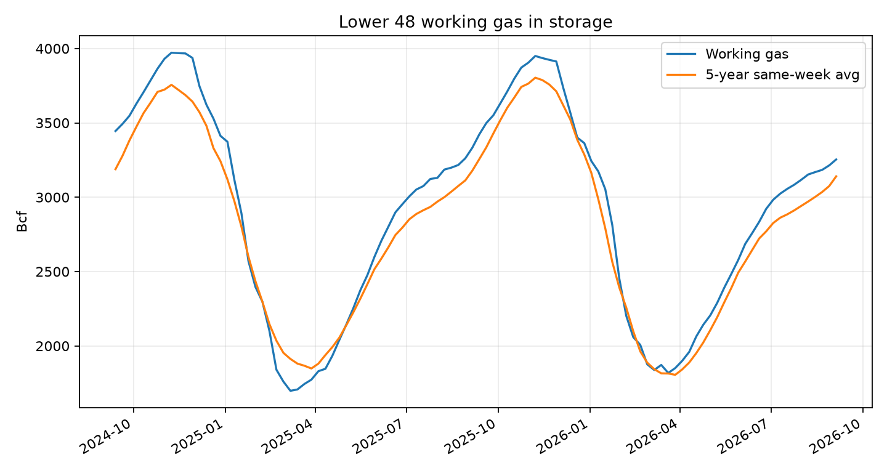
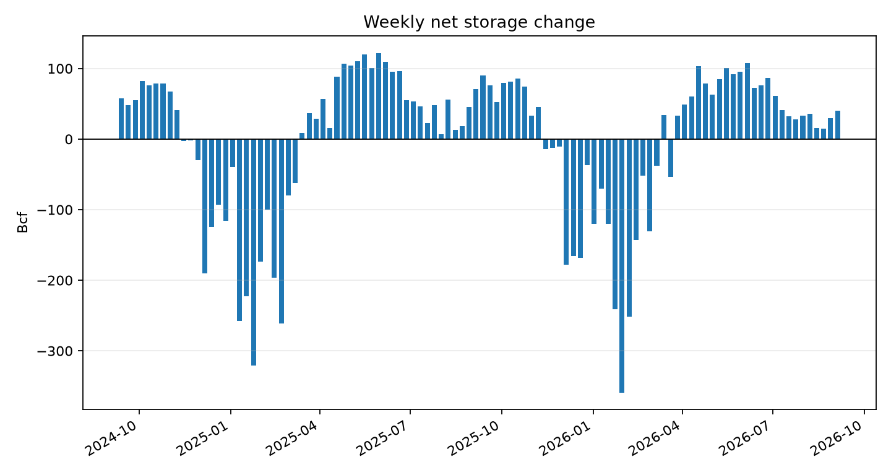
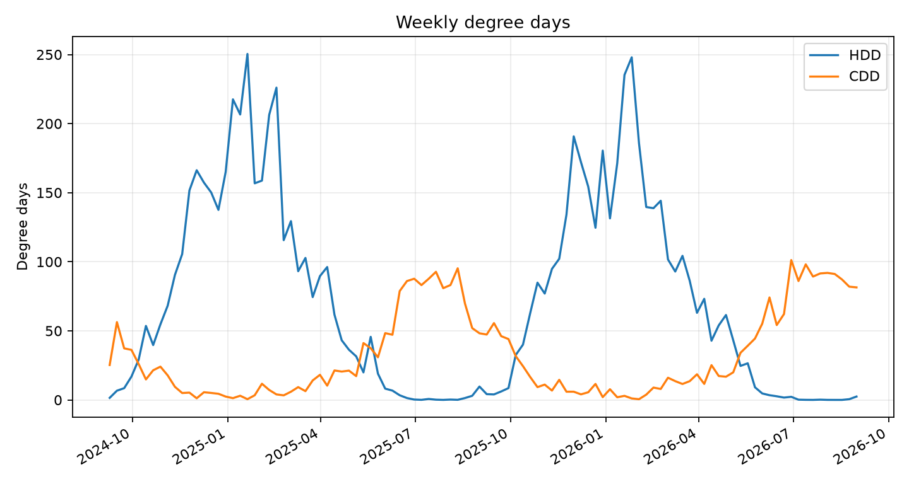

# Natural Gas Storage and Weather Brief - 2026-09-04

## Summary

- Lower 48 working gas was 3,254 Bcf for the storage week reported 2026-09-04.
- Storage changed +40 Bcf week over week.
- Storage was +114 Bcf versus the same-week 5-year average, or +3.6%.
- Storage was -79 Bcf versus the same ISO week one year ago.
- Weather for the aligned week starting 2026-08-31 showed 2.4 HDD and 81.4 CDD.

## Storage

| Metric | Value |
|---|---:|
| Working gas | 3,254 Bcf |
| Weekly net change | +40 Bcf |
| 5-year same-week average | 3,140 Bcf |
| Difference from 5-year average | +114 Bcf |
| Difference from year ago | -79 Bcf |
| 5-year average observations | 5 same-week observations |

## Weather

| Metric | Value |
|---|---:|
| Aligned weather week | 2026-08-31 |
| Weather alignment status | within 0 days |
| HDD | 2.4 |
| HDD versus available same-week average | -7.2 |
| HDD average observations | 1 |
| CDD | 81.4 |
| CDD versus available same-week average | +33.2 |
| CDD average observations | 1 |

## Cutoffs and Provenance

- Storage source: EIA weekly Lower 48 working gas in underground storage, series `NG.NW2_EPG0_SWO_R48_BCF.W`.
- Storage observation date: 2026-09-04.
- Weather source: Open-Meteo historical archive for the repository's 12 representative US stations.
- Weather alignment: latest weekly degree-day row with `week_start` on or before the storage report's ISO week start, 2026-08-31.
- Units: storage in Bcf; HDD/CDD in base-65 Fahrenheit degree days.

## Limits

- The weather series is a simple unweighted average across selected stations. It is not population-weighted or gas-demand-weighted.
- The brief is descriptive. It does not make a price forecast or trade recommendation.
- Storage norms are same-ISO-week averages from committed history and depend on the available observations in `data/eia_storage.parquet`.
